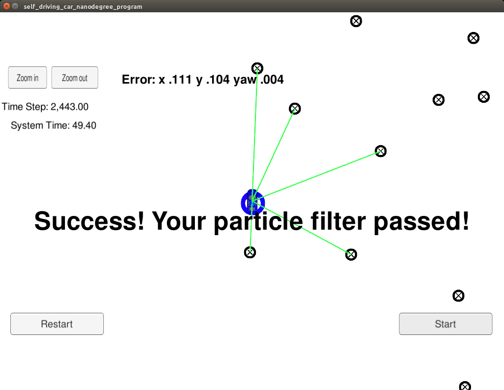

# Kidnapped Vehicle Project
Self-Driving Car Engineer Nanodegree Program
# Overview

This project implements a [Particle Filter](https://en.wikipedia.org/wiki/Particle_filter) applied to a [Kidnapped robot(car) problem](https://en.wikipedia.org/wiki/Kidnapped_robot_problem). A simulator is provided by Udacity ([it could be downloaded here](https://github.com/udacity/self-driving-car-sim/releases)). This simulator will generate noisy landmark observation from a car to the Particle Filter using [WebSocket](https://en.wikipedia.org/wiki/WebSocket). The Particle Filter uses the [uWebSockets](https://github.com/uNetworking/uWebSockets) WebSocket implementation to respond to this observation with the estimated car position. Udacity provides a seed project to start from on this project ([here](https://github.com/udacity/CarND-Kidnapped-Vehicle-Project)).

This project involves the Term 2 Simulator which can be downloaded [here](https://github.com/udacity/self-driving-car-sim/releases)

## How to compile and run: 

    Perform steps following:

    - Clone this repos
    - Compile the code: **./build.sh**
    - Run the code: **./run.sh **
    - Start and run Project 3 Kidnapped Vehicle of Self Driving Car Simulator

## Results: 

